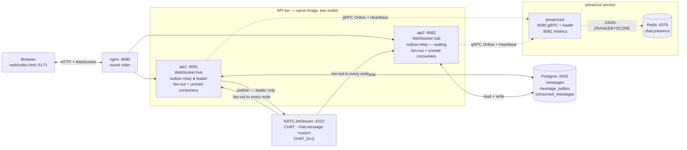
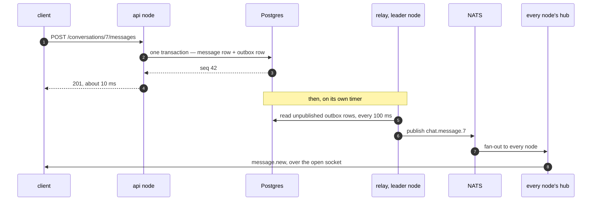
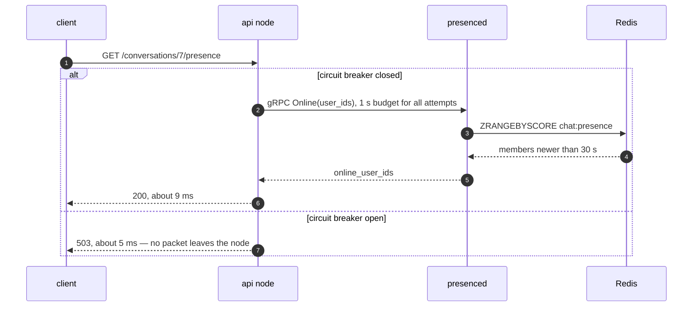
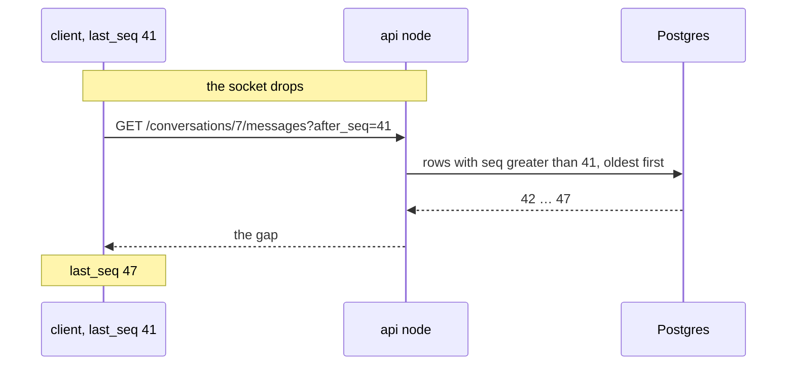

# Architecture

The running system, in one place: every process, the route a message takes
through it, and what the product loses when each part dies.

The other files in `docs/` are plans written *before* a stage. This one is
written after, and it describes what is there now — stages 0 through 6.

---

## The whole system

Seven processes. One entry point, two API nodes that run the same image, and
three things they share.

**Solid arrows are the path a message takes. Dashed arrows are presence** — the
one feature the product can lose and still be a chat. That is not a drawing
choice; it is the reason presence was the right thing to split out in Stage 6.

Two things the picture is careful about:

- **The WebSocket goes through nginx** like any other request. A handshake is an
  HTTP request that asks to stop being one, so there is no second line from the
  nodes back to the browser — delivery comes down the socket that is already
  open. `proxy_read_timeout 600s` in [`nginx.conf`](../nginx.conf) keeps a quiet
  one alive.
- **Only `presenced` connects to Redis.** An API node has no Redis client at
  all since Stage 6, so it cannot read or write `chat:presence` even by
  mistake. The boundary is real, not a naming convention.

---

## Path 1 — a message is sent

The send does **one** write. The message row and the instruction to deliver it
are the same transaction, so a message can never exist without something
telling the cluster about it.

Everything after the `201` happens once the user's request has already
finished. Kill NATS and steps 1 to 4 do not change — the send still answers in
about 10 ms, and the rows wait in `message_outbox` until the broker returns.

One relay drains at a time, chosen by a Postgres advisory lock. Two would
publish `seq 5` before `seq 4` and throw away the ordering Stage 4 built.

---

## Path 2 — who is online

The only path that leaves an API node for another service, and the only one
that is allowed to fail. Each node keeps a **circuit breaker** in front of the
call.

Measured during a real outage:

| | |
| --- | --- |
| A failure while the breaker is closed | **1.006 s** — the client deadline, paid in full |
| A failure once it is open | **4–7 ms**, and that is the HTTP hop; the gRPC call never happens |
| Failures needed to open it | **5**, so about 5 seconds of a dead service |
| Messages lost or delayed meanwhile | **0** |

Every 5 seconds one call is let out as a probe. If it works the breaker closes
and presence comes back with no restart.

---

## Path 3 — after a socket drops

Live push is best effort. The record is Postgres, and every message carries a
per-room sequence number, so a client can see exactly what it missed.

Delivery is at-least-once, so a message can arrive twice and never zero times.
Two keys catch the two directions: `client_msg_id` stops a repeated *send* from
storing a second row, and `seq` stops a repeated *delivery* from being shown
twice.

---

## When one part stops

Every row here was tested by killing the container on purpose. The rule the
whole system is built on: a shared thing may make a node **worse**, it may
never take the node **out**.

| If this stops | What still works | What stops |
| --- | --- | --- |
| `nginx` | The nodes are fine and keep running. | Everything a client can reach. This is the one part with no second copy. |
| `api1` (one node) | Everything. nginx sends traffic to `api2`, which takes the relay lock in about **4 s**. | The sockets on that node. Clients reconnect and repair with `?after_seq=`. Its users fall out of the online list within **30 s** on their own. |
| Postgres | Almost nothing. `/readyz` starts failing, so nginx takes the node out instead of sending it work it cannot do. | Login, history, sending. Nearly every route needs the database — this is the one real dependency. |
| NATS | Login, history, sending. A send still answers `201` in about **10 ms**, the same as a healthy one. | Live push between nodes, and unread counts. Rows queue in `message_outbox` and go out when NATS returns. Nothing is lost, only late. |
| `presenced` | Everything except one endpoint. Nothing on the write or delivery path knows this service exists. | `GET /conversations/:id/presence` answers `503`. After five failed calls the breaker opens and that `503` costs **5 ms** instead of **1 s**. |
| Redis | The same as the row above — `presenced` is its only client. | Presence. `presenced` stays up and answers `Unavailable` honestly, and its gRPC health turns `NOT_SERVING`. |

Three things the Stage 6 outage run taught that are easy to miss:

- **A quiet node stays ignorant.** A breaker learns from traffic. `api1` was
  asked once a second and opened in five seconds; `api2` was asked nothing, so
  its only presence traffic was one heartbeat every ten seconds and its breaker
  never opened. The first user to ask that node pays the full timeout.
- **Coming back is slower than going down.** After `presenced` returned, a user
  still looked offline for another **ten seconds**: the breaker had to reach its
  probe, the probe had to succeed, and then the next heartbeat had to run.
- **No goodbye message, ever.** A node never tells anyone its users left. The
  one moment it could not send such a message is the moment it is killed, which
  is exactly the case presence has to survive.

---

## Processes and ports

Inside the compose network each process uses its normal port. Some are
published to the host on a different number, because something else on this
machine already holds the normal one.

| Process | Port (host) | What it speaks |
| --- | --- | --- |
| `nginx` | 80 (8080) | HTTP and WebSocket. The address a real client should use. |
| `api1` | 8080 (8081) | The same API, but one named node. The check tools use it to say "put this socket on that node". |
| `api2` | 8080 (8082) | The other named node. |
| `presenced` | 9090 (9095) | gRPC, plus the standard `grpc.health.v1` health service. Reflection is on, so `grpcurl` can ask it questions with no copy of the `.proto`. |
| `presenced` | 9091 (9096) | HTTP `/metrics` and `/livez`. A gRPC server cannot serve a Prometheus page, so it gets a second small listener. |
| Postgres | 5432 (5434) | The record: messages, the outbox, and the inbox that makes the unread consumer idempotent. |
| NATS | 4222 (4222) | JetStream. It keeps a copy of an event until a consumer says the work is done. |
| NATS | 8222 (8222) | The monitoring page. Try `/jsz?streams=1`. |
| Redis | 6379 (6380) | One sorted set, `chat:presence`. No volume: everything in it is stale within 30 seconds. |
| `web` | 5173 | The dev client, and the only browser origin CORS and the WebSocket handshake accept. |

---

## Where each piece lives

| Part | Code |
| --- | --- |
| HTTP routes, handlers, middleware | [`internal/server`](../internal/server) |
| WebSocket hub and clients | [`internal/ws`](../internal/ws) |
| Messages, outbox, inbox, migrations | [`internal/database`](../internal/database) |
| The relay that drains the outbox | [`internal/outbox`](../internal/outbox) |
| NATS JetStream, both consumers | [`internal/broker`](../internal/broker) |
| Presence: store, gRPC service, client, breaker | [`internal/presence`](../internal/presence) |
| The presence contract | [`proto/presence/v1`](../proto/presence/v1) |
| Prometheus metrics | [`internal/metrics`](../internal/metrics) |
| The presence service binary | [`cmd/presenced`](../cmd/presenced) |
| Proof tools, one per stage | [`cmd/splitcheck`](../cmd/splitcheck), [`cmd/gapcheck`](../cmd/gapcheck), [`cmd/outboxcheck`](../cmd/outboxcheck), [`cmd/presencecheck`](../cmd/presencecheck) |

Every number on this page came from a real run: `docker compose up`, then the
matching check tool with the dependency killed during the pause. The longer
write-ups are in the [README](../README.md); the stage-by-stage plan is in
[ROADMAP.md](../ROADMAP.md).
